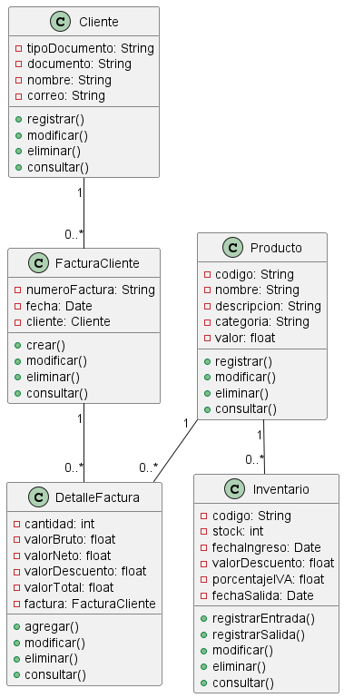
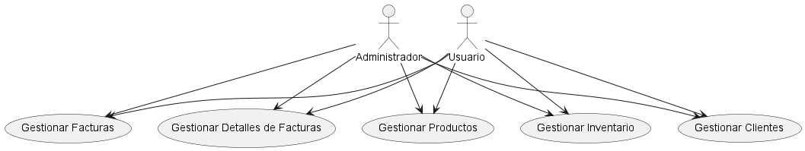
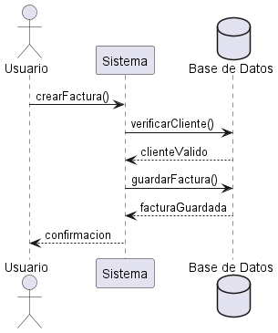

**construccion de diagramas uml**

**Diagrama de Clases**

Descripción:
- El diagrama de clases muestra la estructura estática del sistema, representando las clases que forman parte del sistema y sus relaciones. Este diagrama incluye:

- Cliente: Clase que representa a un cliente en el sistema con atributos como tipoDocumento, documento, nombre y correo. Tiene métodos para registrar, modificar, eliminar y consultar clientes.

- FacturaCliente: Clase que representa una factura asociada a un cliente. Incluye atributos como numeroFactura, fecha y una referencia al cliente. Sus métodos permiten crear, modificar, eliminar y consultar facturas.

- DetalleFactura: Clase que representa los detalles de una factura. Contiene atributos como cantidad, valorBruto, valorNeto, valorDescuento, valorTotal y una referencia a FacturaCliente. Incluye métodos para agregar, modificar, eliminar y consultar detalles de facturas.

- Producto: Clase que representa un producto con atributos como codigo, nombre, descripcion, categoria y valor. Sus métodos permiten registrar, modificar, eliminar y consultar productos.
Inventario: Clase que gestiona el inventario de productos. Tiene atributos como codigo, stock, fechaIngreso, valorDescuento, porcentajeIVA y fechaSalida. Sus métodos incluyen registrar entrada y salida de productos, modificar, eliminar y consultar el inventario.

**Relaciones:**

- Un Cliente puede tener múltiples FacturaCliente.
- Una FacturaCliente puede tener múltiples DetalleFactura.
- Un Producto puede estar en múltiples DetalleFactura y en múltiples Inventario.

**Diagrama de Casos de Uso**

Descripción:

- El diagrama de casos de uso muestra las interacciones entre los actores (usuarios del sistema) y el sistema mismo. Define las funcionalidades principales que el sistema ofrece. En este diagrama, los actores son:

- Administrador: Usuario con privilegios para gestionar todas las funcionalidades del sistema.

- Usuario: Usuario del sistema que puede interactuar con las funcionalidades permitidas.

**Casos de Uso:**

- Gestionar Clientes: Permite registrar, modificar, eliminar y consultar clientes.
- Gestionar Facturas: Permite crear, modificar, eliminar y consultar facturas.
- Gestionar Detalles de Facturas: Permite agregar, modificar, eliminar y consultar detalles de facturas.
- Gestionar Productos: Permite registrar, modificar, eliminar y consultar productos.
- Gestionar Inventario: Permite registrar entradas y salidas de productos, modificar, eliminar y consultar inventario.

 

 
 **Diagrama de Secuencia**

Descripción:
- El diagrama de secuencia muestra la interacción dinámica entre los objetos del sistema para un caso de uso específico. Ilustra cómo los objetos se envían mensajes entre sí en el orden en que ocurren.

Ejemplo de Caso de Uso: Gestionar Facturas

- Usuario solicita crear una factura: El usuario envía una solicitud al sistema para crear una factura.
Sistema verifica la información del cliente: El sistema envía una solicitud a la base de datos para verificar si el cliente es válido.

- Base de Datos confirma la validez del cliente: La base de datos devuelve una respuesta indicando que el cliente es válido.

- Sistema guarda la factura en la base de datos: El sistema envía una solicitud a la base de datos para guardar la nueva factura.

- Base de Datos confirma que la factura ha sido guardada: La base de datos devuelve una respuesta confirmando que la factura ha sido guardada.

- Sistema confirma la creación de la factura al usuario: El sistema envía una confirmación al usuario indicando que la factura ha sido creada exitosamente.

